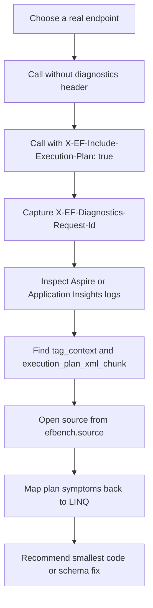

# Investigation Workflow

Use this workflow when the diagnostics package is installed and an endpoint is suspected of causing EF Core query performance problems.

## Flow



## 1. Start Or Discover The Aspire App

Use the Aspire CLI as the control plane:

```bash
aspire run --apphost <path-to-apphost> --non-interactive --nologo
aspire ps --format Json
aspire describe --format Json
```

Record:

- API resource name.
- API base URL.
- Endpoint that exercises the suspected EF Core query.

For this repository's sample app:

```bash
aspire run --apphost samples/EfCoreBenchLab.AppHost/EfCoreBenchLab.AppHost.csproj --non-interactive --nologo
```

## 2. Trigger Capture

Call the endpoint once normally, then once with execution-plan capture enabled:

```bash
curl "http://localhost:<api-port>/<real-endpoint>"
curl -i -H "X-EF-Include-Execution-Plan: true" "http://localhost:<api-port>/<real-endpoint>"
```

Save the `X-EF-Diagnostics-Request-Id` response header if present. If the response header is not available, use the closest timestamp and endpoint path when searching logs.

## 3. Inspect Logs

Start with text logs:

```bash
aspire logs <api-resource-name> --tail 200 --timestamps
```

Then inspect structured OpenTelemetry records:

```bash
aspire otel logs <api-resource-name> --limit 100 --format Json
aspire otel spans <api-resource-name> --limit 100 --format Json
```

Search for:

- `request_id`
- `include_execution_plan`
- `tag_context`
- `source`
- `execution_plan_xml_chunk`

## 4. Optional: Inspect Remote Application Insights

This step is only for an optional Azure demo or a production-like deployment. Local Aspire logs/OpenTelemetry are enough to test the package.

For deployed Azure Container Apps, use the Application Insights resource created by `azd` from the Aspire AppHost. Logs can take up to 5 minutes to appear in Application Insights, so wait before concluding that capture failed.

The repo-local `skills/efcore-appinsights-investigator` skill contains Azure CLI and optional Azure MCP commands for this remote path.

Find EF command logs and plan-capture summaries:

```kusto
traces
| where timestamp > ago(30m)
| where message has "EF command executed"
   or message has "EF actual execution plan captured"
   or message has "EF actual execution plan chunk"
| extend request_id = tostring(customDimensions["request_id"])
| extend include_execution_plan = tostring(customDimensions["include_execution_plan"])
| extend tag_context = tostring(customDimensions["tag_context"])
| extend source = tostring(customDimensions["source"])
| extend duration_ms = todouble(customDimensions["duration_ms"])
| project timestamp, operation_Id, request_id, include_execution_plan, tag_context, source, duration_ms, message, customDimensions
| order by timestamp desc
```

Rebuild a captured execution plan for one request:

```kusto
let requestId = "<X-EF-Diagnostics-Request-Id>";
traces
| where timestamp > ago(30m)
| where message has "EF actual execution plan chunk"
| where tostring(customDimensions["request_id"]) == requestId
| extend command_id = tostring(customDimensions["command_id"])
| extend execution_plan_sha256 = tostring(customDimensions["execution_plan_sha256"])
| extend chunk_index = toint(customDimensions["execution_plan_chunk_index"])
| extend chunk_count = toint(customDimensions["execution_plan_chunk_count"])
| extend chunk = tostring(customDimensions["execution_plan_xml_chunk"])
| order by command_id asc, chunk_index asc
| summarize execution_plan_xml = strcat_array(make_list(chunk), "")
    by request_id = requestId, command_id, execution_plan_sha256, chunk_count
```

Find suspicious endpoints without on-demand execution-plan capture:

```kusto
let efCommands =
    traces
    | where timestamp > ago(24h)
    | where message has "EF command executed"
    | extend duration_ms = todouble(customDimensions["duration_ms"])
    | extend tag_context = tostring(customDimensions["tag_context"])
    | summarize db_command_count = count(),
        total_db_ms = sum(duration_ms),
        p95_db_ms = percentile(duration_ms, 95),
        query_tags = make_set(tag_context, 20)
      by operation_Id;
requests
| where timestamp > ago(24h)
| join kind=leftouter efCommands on operation_Id
| summarize request_count = count(),
    avg_request_ms = avg(duration),
    p95_request_ms = percentile(duration, 95),
    avg_db_commands = avg(db_command_count),
    avg_total_db_ms = avg(total_db_ms),
    query_tags = make_set(query_tags, 20)
  by name
| order by p95_request_ms desc
```

## 5. Read The Diagnostic Record

A useful captured record should answer:

| Field | Why it matters |
| --- | --- |
| `request_id` | Correlates HTTP request, EF commands, spans, and plan capture. |
| `tag_context` | Names the query or business operation. |
| `source` | Points to the class/member/line that added `TagWithContext`. |
| `duration_ms` | Gives a first-order impact signal for the command. |
| `execution_plan_xml_chunk` | Contains chunked SQL Server actual execution-plan XML. Reassemble chunks by `request_id`, `command_id`, and `execution_plan_chunk_index`. |

## 6. Interpret Common Symptoms

| Symptom | Common LINQ shape | Likely impact |
| --- | --- | --- |
| `LIKE '%term%'` | `.Contains(term)` on SQL Server | Cannot seek into a normal b-tree index. |
| `LOWER(column)` or functions around columns | `.ToLower()` in query predicate | Can make the predicate non-sargable. |
| Concatenated search text | `a + " " + b + " " + c` | Forces computed expression evaluation per row. |
| Sort before paging | `.OrderBy(...).Skip(...).Take(...)` after weak filtering | Sorts many rows to return a small page. |
| Many similar EF command logs | Query inside a loop | N+1 request amplification. |
| Fetched rows much greater than returned rows | `.ToListAsync()` before filtering/paging | Moves filtering work from SQL Server to application memory. |

## 7. Locate The Source

Use the `efbench.source` value:

```text
OrderSearchRepository:SearchWithKnownPerformanceProblemAsync:44
```

Search for that class and member, then map the SQL/plan symptoms back to the LINQ expression. Report the smallest fix that changes the query shape, index strategy, or search design.

## Reporting Template

```text
Request: <request_id>
Endpoint: <method/path>
Query tag: <tag_context>
Source: <file>:<member>:<line>
Impact: <duration, rows read, rows returned, repeated calls, or memory pressure>
Plan symptoms: <scan, sort, lookup, function predicate, LIKE pattern, etc.>
Likely cause: <LINQ shape or schema gap>
Smallest fix: <code/index/search change>
Follow-up test: <endpoint and expected log/plan change>
```
