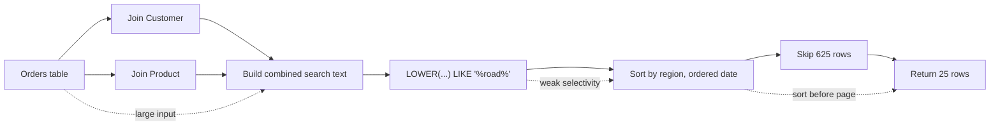

# Sample Diagnosis: Wildcard Search

This sample explains the intentionally bad endpoint:

```http
GET /scenarios/bad/wildcard-search?search=road&page=25&pageSize=25
X-EF-Include-Execution-Plan: true
```

The point of the sample is not that every wildcard search is bad. The point is that the diagnostics package can connect a bad SQL Server plan back to the LINQ query that produced it.

## Source Tag

The query is tagged in `samples/EfCoreBenchLab.Api/Features/Orders/OrderSearchRepository.cs`:

```csharp
return await dbContext.Orders
    .TagWithContext("DeepBadOrderSearch: wildcard text search across joined order data")
    .AsNoTracking()
    .Where(order => order.Status != "Cancelled")
    .Where(order =>
        (order.Customer.Name + " " + order.Customer.Region + " " + order.Product.Name + " " + order.SalesPerson)
        .ToLower()
        .Contains(loweredSearch))
    .OrderBy(order => order.Customer.Region)
    .ThenBy(order => order.OrderedAt)
    .Skip(page * pageSize)
    .Take(pageSize)
    .Select(order => new OrderSearchResult(...))
    .ToListAsync(cancellationToken);
```

The emitted SQL contains comments like:

```sql
-- efbench.context:DeepBadOrderSearch: wildcard text search across joined order data
-- efbench.source:OrderSearchRepository:SearchWithKnownPerformanceProblemAsync:44
```

Those comments let an agent move from Aspire logs to the exact LINQ chain.

## Why The Query Is Expensive

| Source shape | SQL/plan symptom | Impact |
| --- | --- | --- |
| Concatenates customer, region, product, and salesperson text | SQL Server must evaluate a computed expression across joined rows | More CPU per candidate row. |
| Calls `.ToLower()` inside the predicate | Predicate uses a function around the search expression | Normal indexes cannot be used efficiently for the transformed expression. |
| Uses `.Contains(loweredSearch)` | SQL Server pattern is effectively `LIKE '%road%'` | Leading wildcard prevents a normal seek. |
| Orders by region and date after weak filtering | Sort operator before paging | Many rows may be sorted to return one small page. |
| Uses `.Skip(page * pageSize).Take(pageSize)` | Offset paging | Work grows as page number increases. |

## Data Flow View



The visual point: the request returns a small page, but the database may scan, compute, and sort a much larger intermediate set.

## What To Look For In Aspire Logs

A useful investigation should find:

- `include_execution_plan=true`
- `tag_context=DeepBadOrderSearch: wildcard text search across joined order data`
- `source=OrderSearchRepository:SearchWithKnownPerformanceProblemAsync:<line>`
- `execution_plan_xml_chunk=<ShowPlanXML ...>`

In the execution plan, look for:

- broad scans instead of selective seeks
- scalar computation or function predicates
- `LIKE` with a leading wildcard
- sort before `OFFSET/FETCH`
- high rows read compared with rows returned

## Potential Fixes

Pick the fix based on the product requirement:

| Requirement | Better shape |
| --- | --- |
| Search across free text | Use SQL Server full-text search or a search service. |
| Prefix search is enough | Store normalized searchable columns and use `StartsWith`/prefix predicates that can seek. |
| Search only one field | Query that field directly instead of concatenating several columns. |
| Page through deep result sets | Prefer keyset pagination where the UX allows it. |
| Keep ad hoc search but reduce blast radius | Add a selective predicate first, such as tenant, date range, status, or category. |

## Expected Remediation Test

After changing the query, rerun:

```bash
curl -i -H "X-EF-Include-Execution-Plan: true" \
  "http://localhost:<api-port>/scenarios/bad/wildcard-search?search=road&page=25&pageSize=25"
aspire logs api --tail 200 --timestamps
aspire otel logs api --limit 100 --format Json
```

The improved result should show one or more of:

- fewer rows read
- no broad computed text scan
- no expensive sort over a large intermediate set
- lower command duration
- same `tag_context` and `source`, proving the same code path was measured
