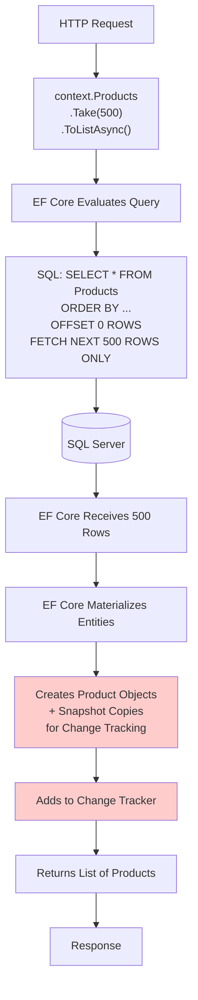
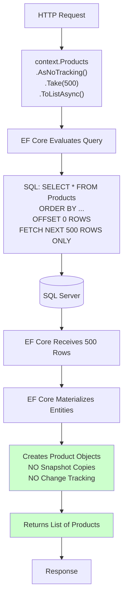
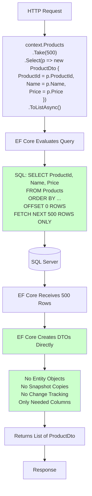
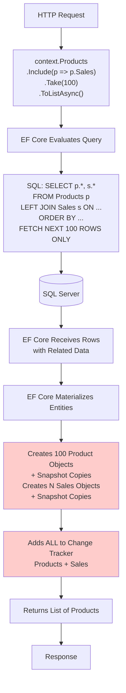
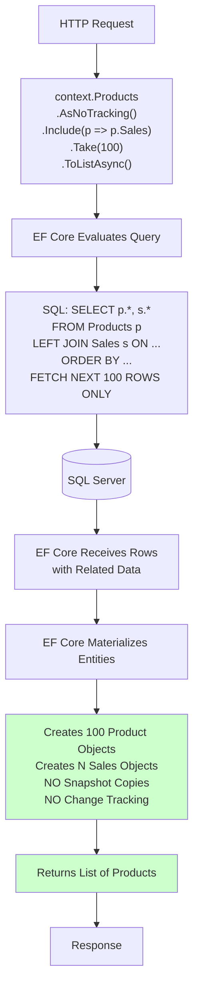
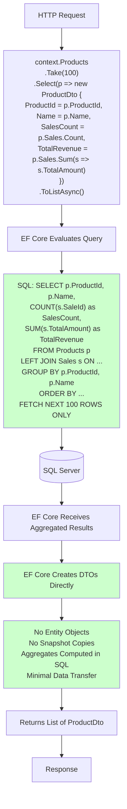

# EF Core Tracking Diagrams

## #1 What is going on? (With Tracking - Default Behavior)

**Key Points:**
- EF Core creates **snapshot copies** of each entity for change detection
- All 500 entities are tracked in the Change Tracker
- Memory overhead: ~2-3x more than NoTracking
- Unnecessary for read-only queries

---

## #2 How is this better? (AsNoTracking)

**Key Points:**
- EF Core **skips** snapshot creation
- Entities are **not** added to Change Tracker
- Same data, less memory overhead
- Faster materialization
- Perfect for read-only scenarios

---

## #3 Best Approach (Direct Projection)

**Key Points:**
- **No entity objects** created at all
- Only fetches **columns needed** for the DTO
- Minimal memory usage
- Fastest materialization
- Best for display/reporting scenarios

---

## #4 Tracking with Relations (Worst Case)

**Key Points:**
- Tracking overhead **multiplies** with each relation
- Both Products AND Sales are tracked
- Maximum memory overhead
- Worst performance for read-only queries

---

## #5 NoTracking with Relations (Better)

**Key Points:**
- Related entities loaded without tracking overhead
- Still fetches all columns (could be optimized)
- Better than tracking, but projection is still best

---

## #6 Projection with Aggregates (Best for Reporting)

**Key Points:**
- Aggregates computed **in SQL**, not in memory
- Only aggregated results transferred
- No entity objects, no tracking
- Best for reporting/analytics scenarios

---

## Fact Check: IEnumerable vs IQueryable Diagrams

### Diagram #1: "What is going on?" (IEnumerable Issue)

**✅ CORRECT**

The diagram correctly illustrates that:
- Using `IEnumerable<Sale>` (like `context.Sales` directly) causes EF Core to materialize the query immediately
- EF Core generates `SELECT * FROM Sales` and loads ALL records into memory
- Operations like `.Count()` then execute in-memory on the loaded collection
- This is inefficient because it fetches unnecessary data

**Technical Accuracy:**
- When you access `DbSet<T>` as `IEnumerable`, EF Core materializes immediately
- The `.Count()` operation happens in C# memory, not in SQL
- This is a common performance anti-pattern

### Diagram #2: "How is this better?" (IQueryable with Count)

**✅ CORRECT**

The diagram correctly illustrates that:
- Using `IQueryable<Sale>.Count()` allows EF Core to evaluate the entire query expression tree
- EF Core translates `.Count()` to `SELECT COUNT(*) FROM Sales`
- Only a single integer is returned from the database
- This is efficient because the count happens in SQL

**Technical Accuracy:**
- `IQueryable` defers execution until enumeration
- EF Core's query provider translates LINQ to SQL
- `COUNT(*)` executes efficiently on the database server
- This is the recommended approach for counting

**Note:** These diagrams are about `IEnumerable` vs `IQueryable`, not specifically about tracking, but they demonstrate an important EF Core performance concept.

